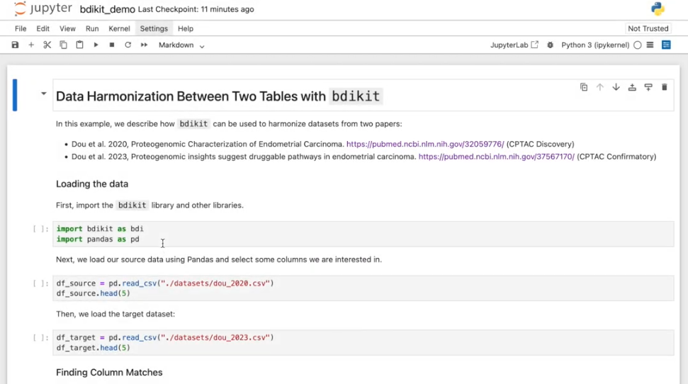

[](https://pypi.org/project/bdi-kit)
[](https://opensource.org/licenses/Apache-2.0)
[](https://bdi-kit.readthedocs.io)
[](https://github.com/VIDA-NYU/bdi-kit/actions/workflows/build.yml)
[](https://github.com/VIDA-NYU/bdi-kit/actions/workflows/lint.yml)


# BDI-Kit 

**BDI-Kit** is a library that assist users in performing data harmonization. It provides state-of-the-art tools to streamline the process of integrating and transforming disparate datasets (with a focus on biomedical data), and includes APIs for performing tasks such as:
- Schema matching
- Value matching
- Data transformation to a target schema/standard


## 📚 Documentation

Documentation is available at [https://bdi-kit.readthedocs.io/](https://bdi-kit.readthedocs.io/).


## 🛠️ Installation

You can install the latest stable version of this library from [PyPI](https://pypi.org/project/bdi-kit/):

```
pip install bdi-kit
```

To install the latest development version:

```
pip install git+https://github.com/VIDA-NYU/bdi-kit@devel
```


## 🎬 Demo Video

This video demonstrates a brief overview of BDI-Kit, showcasing its functionality through both the Python API and the chatbot-style agent interface.

[](https://drive.google.com/file/d/1gMlZuocYrKFQYDZOphIyFj-nvjtx4ODR/view?usp=sharing)


## 🤝 Contributing

To learn more about making a contribution to BDI-Kit, please see our [Contributing guide](./CONTRIBUTING.md).


## 🔖 Citation

If you find BDI-Kit useful in your work, please consider citing:

```bibtex
@article{lopez2026bdikit,
  title={{BDI-Kit: An AI-Powered Toolkit for Biomedical Data Harmonization}},
  author={Lopez, Roque and Santos, Aecio and Koutras, Christos and Freire, Juliana},
  journal={{Patterns}},
  volume={7},
  year={2026}
}
```


You can also find [here](https://bdi-kit.readthedocs.io/) our other papers related to the BDI-Kit library.