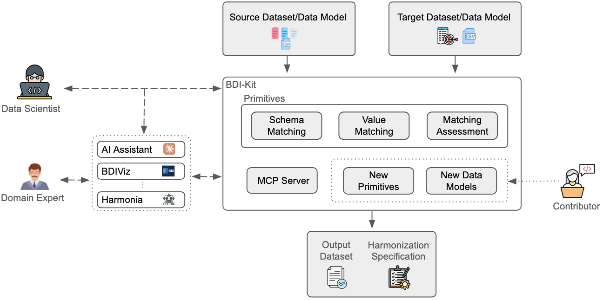

How BDI-Kit Works
=================

The library is designed around a human-in-the-loop workflow.
Instead of treating harmonization as a fully automatic process,
BDI-Kit allows users to inspect intermediate results, review suggested
matches, and refine mappings before generating the final harmonized dataset.

Overview
--------
Below is an overview of the BDI-Kit harmonization workflow.

Inputs
------

A harmonization task consists of a source and a target, where each
can be either a dataset represented as a pandas DataFrame or a
data model. Data models
include metadata such as attribute names and  descriptions, 
allowing BDI-Kit to support different standards and schemas.

Harmonization Primitives
------------------------

BDI-Kit provides composable primitives that can be combined into
custom workflows.

Schema Matching
^^^^^^^^^^^^^^^^

Schema matching identifies relationships between attributes/columns in the
source and target datasets. For example, BDI-Kit can suggest that:

- ``patient_age`` matches ``age_at_diagnosis``
- ``sex`` matches ``gender``

Each match includes similarity scores so users can inspect
alternative candidates and resolve ambiguous cases.

Value Matching
^^^^^^^^^^^^^^

After attributes/columns are matched, value matching aligns the values inside
those attributes/columns. For example:

- ``"Male"`` → ``"M"``
- ``"Stage II"`` → ``"2"``

BDI-Kit supports multiple value matching strategies, including
textual similarity, embedding-based methods, and numeric
transformations.

Match Assessment
^^^^^^^^^^^^^^^^

BDI-Kit also provides tools to assess and explain matches.
These explanations help users understand why a match was proposed
and identify potentially incorrect mappings before applying
transformations.

Harmonization Specification
---------------------------

The result of the harmonization process is:

- A **harmonized dataset**
- A **harmonization specification**

The harmonization specification stores the transformations and
mappings used during harmonization, making the process transparent
and reproducible. Specifications can also be reused on new datasets with similar
schemas, reducing the need to repeat the same harmonization steps.

Interaction Options
-------------------

BDI-Kit supports two ways of interacting with the system.

- **Python API**: Users can directly call harmonization functions from Python and integrate them into data pipelines and notebooks.

- **AI-Assisted Interface**: In this mode, AI assistants can help orchestrate harmonization tasks using natural language while users remain in control of accepting or refining suggestions.

Extensibility
-------------

BDI-Kit is designed to be extensible. Developers can:

- Add new schema matching algorithms
- Add new value matching methods
- Support additional data models
- Integrate BDI-Kit into external AI systems and workflows

This modular design allows the toolkit to evolve alongside new
harmonization methods and domain requirements.

Related Publications
--------------------

For more details about the design and capabilities of BDI-Kit, see our papers:

- `BDI-Kit: An AI-Powered Toolkit for Biomedical Data Harmonization <https://www.cell.com/action/showPdf?pii=S2666-3899%2825%2900318-6>`__  (preferred citation)
- `BDI-Kit Demo: A Toolkit for Programmable and Conversational Data Harmonization <https://arxiv.org/pdf/2604.06405>`__
