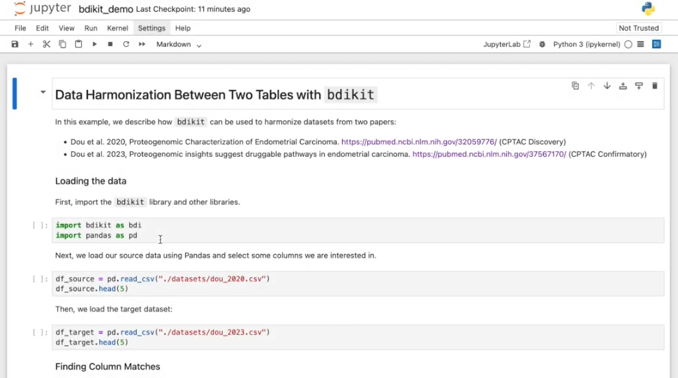

BDI-Kit Documentation
=====================

**Version:** |version|

**BDI-Kit** is a toolkit designed to assist users in performing data harmonization (see our `GitHub repository <https://github.com/VIDA-NYU/bdi-kit>`__). It provides state-of-the-art tools to streamline the 
integration and transformation of disparate datasets, with a particular focus on biomedical data. BDI-Kit includes methods for tasks such as:

- Schema matching
- Value matching
- Data transformation to a target table or data model

BDI-Kit can be used in two complementary ways:

- 🐍 **Python API** — Programmatic data harmonization workflows
- 🤖 **AI Agent** — Conversational data harmonization using natural language

The following quick demo illustrates how BDI-Kit can be used through both the Python API and the AI agent:

.. toctree::
   :maxdepth: 2
   :caption: User Guide
   :hidden:

   how-works
   installation
   quick-start
   getting-started
   examples
   contributing

.. toctree::
   :maxdepth: 1
   :caption: API Reference
   :hidden:

   api
   schema-matching
   value-matching
